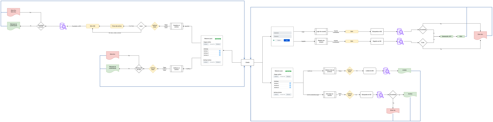

# Infraestructura del Proyecto

## Diagrama de infraestructa



## Tecnologías Utilizadas

### 📌 Frontend

- **Framework**: React
- **Almacenamiento de Tokens**: JWT almacenado en el navegador
- **Características principales**:
  - Formulario de Login/Register
  - Pantalla de inicio con generación de claves RSA
  - Subida y verificación de archivos firmados digitalmente

### 📡 Backend

- **Framework**: FastAPI (Python)
- **Autenticación**: JSON Web Tokens (JWT)
- **Cifrado de Contraseñas**: SHA-256
- **Firma Digital**: RSA/ECC para validación de archivos
- **Manejo de Archivos**: FastAPI UploadFile

### 🗄 Base de Datos

- **Tipo**: NoSQL
- **Gestor**: MongoDB
- **Colecciones**:
  - `users`: Almacena credenciales y claves públicas de los usuarios
  - `files`: Guarda archivos con sus respectivas firmas y claves públicas

## 📍 Endpoints del Backend

| Endpoint                   | Método | Descripción                                                                       |
| -------------------------- | ------ | --------------------------------------------------------------------------------- |
| `/login`                   | POST   | Recibe email y password, valida credenciales y genera un JWT                      |
| `/register`                | POST   | Recibe email y password, cifra la contraseña con SHA y guarda el usuario en la BD |
| `/archivos`                | GET    | Devuelve la lista de archivos disponibles                                         |
| `/archivos/{id}/descargar` | GET    | Descarga un archivo y devuelve la clave pública del propietario                   |
| `/guardar`                 | POST   | Guarda un archivo firmado con RSA/ECC o sin firmar                                |
| `/verificar`               | POST   | Recibe un archivo y su clave pública para verificar su autenticidad               |

## 🔄 Flujo de Trabajo

1️⃣ **Registro/Login**

- El usuario se registra o inicia sesión, obteniendo un token JWT

2️⃣ **Generación de Claves**

- Se genera un par de claves RSA (privada y pública)
- La clave privada se descarga, la clave pública se almacena en la BD

3️⃣ **Subida de Archivos**

- Los usuarios pueden subir archivos con o sin firma digital
- Si se firma, se requiere la clave privada
- Los archivos se almacenan en MongoDB con la firma y la clave pública

4️⃣ **Descarga de Archivos**

- Los usuarios pueden descargar archivos junto con la clave pública del propietario

5️⃣ **Verificación de Firma**

- Se valida la firma de un archivo antes de la descarga usando la clave pública

## 📜 Consideraciones de Seguridad

- Uso de **JWT** para autenticación segura
- Cifrado de contraseñas con **SHA-256**
- Firma digital con **RSA/ECC** para garantizar la autenticidad de los archivos
- Almacenamiento seguro de claves públicas en la base de datos

## 🚀 Instalación y Configuración

1. **Clonar el repositorio**

```bash
  git clone <repositorio>
  cd <directorio>
```

2. **Backend (FastAPI)**

```bash
  pip install -r requirements.txt
  uvicorn main:app --reload
```

3. **Frontend (React)**

```bash
  npm install
  npm start
```

4. **Base de Datos (MongoDB)**

- Configurar una instancia de MongoDB local o en la nube
- Definir las variables de entorno para la conexión

##

